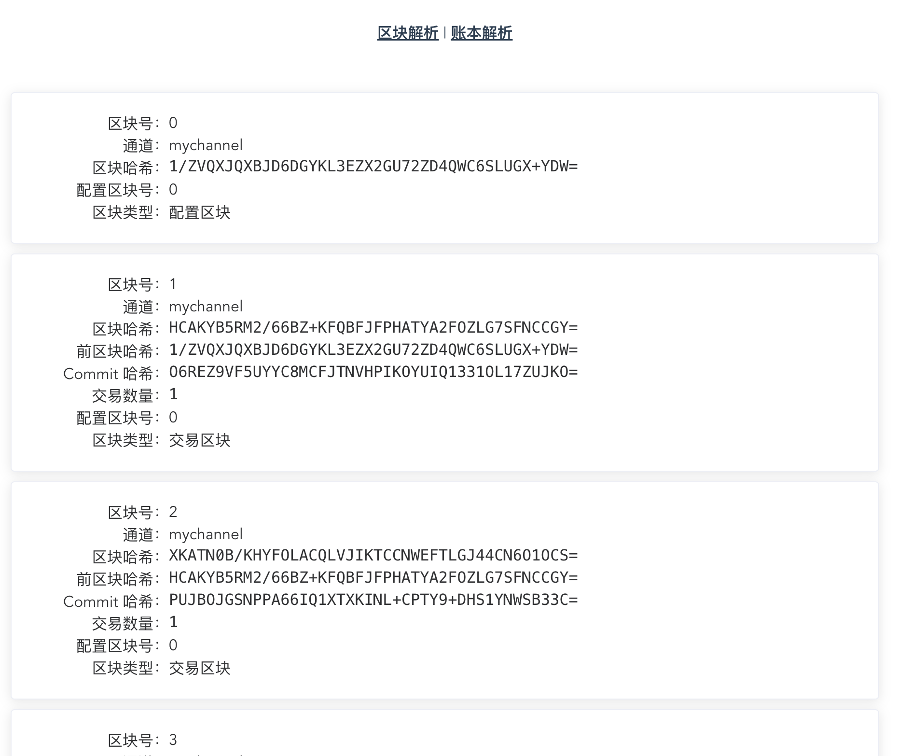

[](https://github.com/tinywell/blocklator/network)
[](https://github.com/tinywell/blocklator/stargazers)
[](https://github.com/tinywell/blocklator)
# blocklator

这是一个用于解析 hyperledger/fabric 区块链网络产生的区块和账本的 web 小工具。可以解析查看配置区块中的组织结构、共识参数等，也可以解析交易区块中各交易提案和回复的详细数据。还可以直接解析账本文件，提取出其中的所有区块并解析。

前端使用 vue，后端使用 gin 提供 RESTful API，并由 gin 代理前端编译后的静态网页文件。

# 安装部署

## 获取源码

```
git clone https://github.com/tinywell/blocklator.git
```

## 本地编译部署

本地编译需要有 Node 环境及 go 环境

编译：

```
cd blocklator
make front
make backend
```

启动：

```
./blocklator server
```

或者

```
make start
```

## docker 编译部署

docker 编译部署需要有 docker 环境

编译：

```
cd blocklator
make docker
```

启动：

```
docker-compose up -d
```

# 使用说明

## 区块解析

区块解析可以直接拖拽或点击上传区块文件（比如通过 `peer channel fetch` 命令或其他方式从通道中获取的区块文件）进行解析，也可以直接粘贴经过 base64 编码的区块数据。


比如交易区块，会解析出交易提案相关请求参数以及回复信息、背书信息等。


## 账本解析

账本解析可以直接拖拽或上传通道账本（比如 peer 节点中维护的 blockfile_000000）,解析出其中的所有区块，展示区块列表，并支持查看区块详情。


